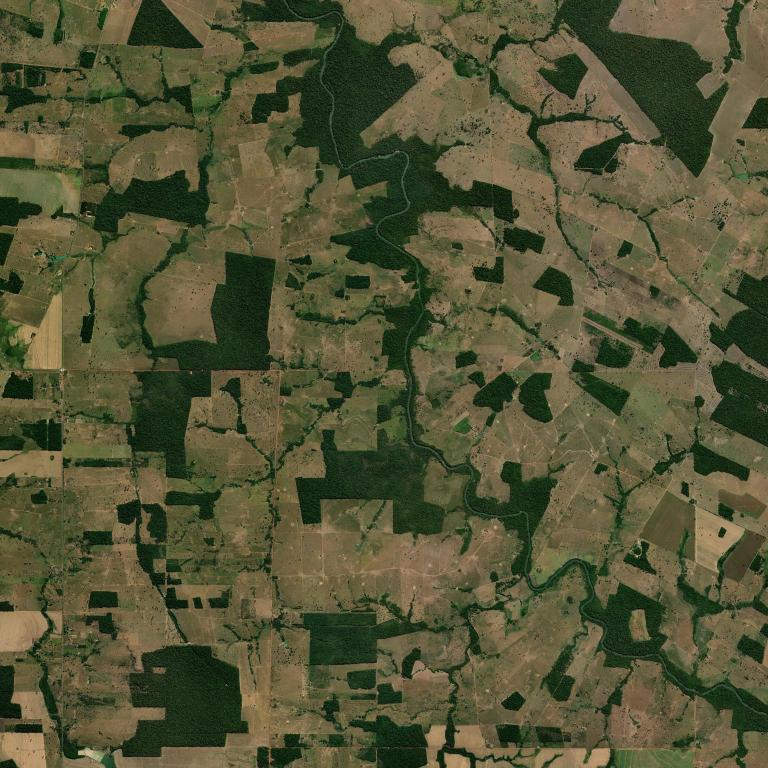
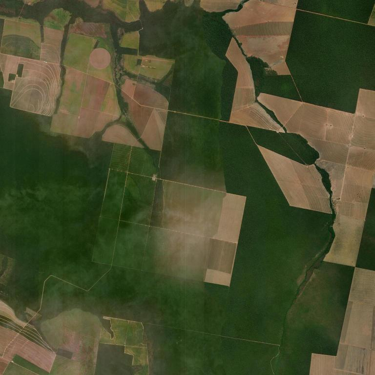
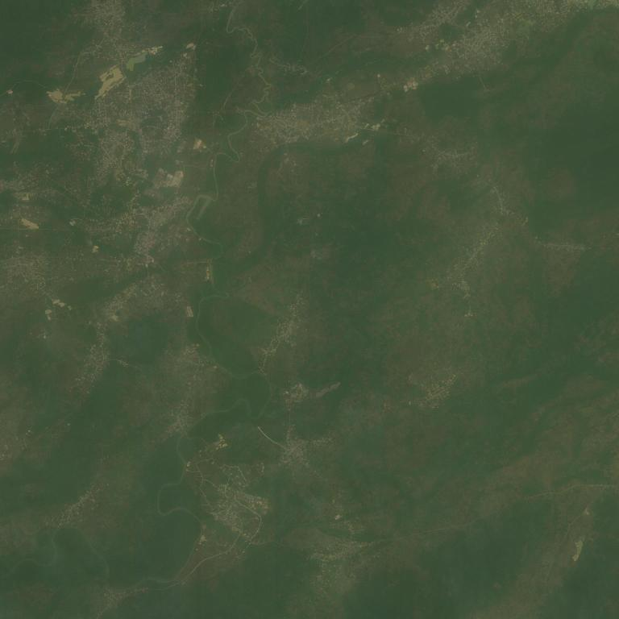

# Project Okavango — Environmental Analysis Tool
### Advanced Programming 2026 | Group F | NOVA SBE

An AI-powered environmental monitoring tool that combines satellite imagery analysis with global deforestation data to detect at-risk areas worldwide. Built as part of a two-day hackathon focused on environmental protection using the most recent data available.

---

## What it does

- Visualizes global environmental indicators (deforestation, land protection, biodiversity) on interactive world maps
- Allows users to select any coordinates on Earth, download a live satellite image, and run AI analysis on it
- Uses local AI models via [Ollama](https://ollama.com) to describe the image and assess whether the area is at environmental risk
- Caches all results to avoid redundant computation

---

## Environmental Indicators

Data sourced from [Our World in Data](https://ourworldindata.org):

- Annual change in forest area
- Annual deforestation
- Terrestrial protected areas
- Forest area as share of land area
- Red List Index (biodiversity)

Geospatial data from [Natural Earth](https://www.naturalearthdata.com/downloads/110m-cultural-vectors/).

---

## Members

| Name | Student Number | Email |
|------|---------------|-------|
| Petra Ignjatovic | 72179 | 72179@novasbe.pt |
| Nino Makharadze | 75057 | 75057@novasbe.pt |
| Javiera Prenafeta | 75087 | 75087@novasbe.pt |
| Maddalena Manfredi | 71946 | 71946@novasbe.pt |

---

## Repository Structure

```text
Group_F/
├── Project/                    # Assignment documentation
│   ├── Part1.md                # Description of Part 1 assignment
│   └── Part2.md                # Description of Part 2 assignment
├── app/                        # Streamlit application
│   ├── ourStreamlitApp.py      # Main app entry point
│   ├── _pages/
│   │   └── aiAnalysis.py       # AI image analysis page
│   └── utils/
│       └── charts.py           # Reusable chart/visualization functions
├── database/                   # Cached AI analysis results
│   └── images.csv              # Stores past image analyses to avoid re-runs
├── downloads/                  # Downloaded environmental datasets
│   ├── annual-change-forest-area.           # Annual forest area change data
│   ├── annual-deforestation.                # Annual deforestation data
│   ├── forest-area-as-share-of-land-area.   # Forest share of land data
│   ├── terrestrial-protected-areas.         # Protected areas data
│   ├── red-list-index.                      # Biodiversity Red List Index
│   ├── all_world_countries.xlsx             # Country reference list
│   └── countries/              # Natural Earth shapefiles for world map
├── images/                     # Downloaded satellite images
├── notebooks/                  # Data processing & pipeline scripts
│   ├── DataProcessor.py        # Data loading and merging
│   ├── ImageDownloader.py      # Satellite images download via APIs
│   ├── Locations.py            # Coordinate handling & AI analysis calls
│   └── Processing.py           # Data cleaning and transformation
├── .gitignore
├── LICENSE
├── models.yaml                 # AI model configuration (vision + text models)
├── README.md                   # Project documentation (this file)
└── requirements.txt            # Python dependencies
```
--- 

## Installation & Setup

### Prerequisites
- Python 3.10+
- [Ollama](https://ollama.com) installed and running on your machine
- see requirements.txt file (vorrei linkarlo al file che ho nella repository)

### 1. Clone the repository  

Install python in the file requirements you have the requirement and for the test 

```bash
git clone https://github.com/AdPro26/Group_F.git
cd Group_F
```

### 2. Install Python dependencies
```bash
pip install -r requirements.txt
```

### 3. Run the app
```bash
streamlit run app/ourStreamlitApp.py
```

> The app will automatically pull the required AI models (`llava:7b`, `llama3.2:3b`) via Ollama on first use if they are not already installed.

### 4. Run tests
```bash
pytest
```

---

## AI Configuration

The AI pipeline is fully configurable via [`models.yaml`](models.yaml):

```yaml
image_analysis:
  model: "llava:7b"          # Vision model for image description
  prompt: "Describe this satellite image focusing on: land use, vegetation coverage, signs of deforestation or forest clearing, human infrastructure such as roads or buildings, mining activity, and any visible environmental degradation."
  max_tokens: 300
  temperature: 0.3

text_analysis:
  model: "llama3.2:3b"       # Text model for risk assessment
  prompt: "You are an environmental analyst. Given this satellite image description, detect signs of HUMAN-CAUSED environmental damage. Key indicators include: grid-like roads cutting through forest, cleared rectangular fields surrounded by dense forest (deforestation), bare soil patches replacing vegetation, mining pits, or industrial pollution. Respond strictly in this format: 'Y: [reason]' or 'N: [reason]'. One sentence only. No other text."
  max_tokens: 150
  temperature: 0.1
```

To use different models, simply update `models.yaml` — no code changes needed.

---

## Environmental Danger Examples

Below are three examples of the app successfully identifying environmental risks.

### Example 1 — Rondônia Deforestation, Brazil
**Coordinates:** Lat -11.5, Lon -61.7, Zoom 13



> **Image description:** The satellite image depicts a landscape with a mix of land use and vegetation coverage. The area is predominantly covered with a variety of green vegetation, indicating a healthy ecosystem. There are patches of bare land, which could suggest deforestation or forest clearing, particularly in the lower left quadrant of the image. The water bodies are scattered throughout the landscape, which could be natural or man-made.

> ⚠️ **ENVIRONMENTAL RISK DETECTED** — Y: Bare land patches in the lower left quadrant could suggest deforestation or forest clearing.

---

### Example 2 — Mato Grosso Deforestation, Brazil
**Coordinates:** Lat -12.9, Lon -52.0, Zoom 13



> **Image description:** The image shows a mix of land uses. There are areas predominantly covered with vegetation, which could be a mix of grasslands, pastures, or forests. There are areas where the vegetation has been cleared, creating a patchwork of green and brown areas. These cleared areas could be the result of deforestation for agriculture, infrastructure development, or other human activities.

> ⚠️ **ENVIRONMENTAL RISK DETECTED** — Y: Signs of deforestation or forest clearing are visible, indicating human-caused environmental damage.

---

### Example 3 — Niger Delta, Nigeria
**Coordinates:** Lat 5.4, Lon 5.9, Zoom 13



> **Image description:** The image shows a mix of land use types. There are areas with dense vegetation, which could be forests, and open areas that might be agricultural fields. There are patches where the vegetation appears to be less dense, which could indicate areas where forests have been cleared or deforested. These patches are surrounded by greener areas, suggesting they might be in the process of being cleared.

> ⚠️ **ENVIRONMENTAL RISK DETECTED** — Y: Signs of deforestation or forest clearing due to the presence of patches with less dense vegetation surrounded by greener areas.

---

## Contribution to UN Sustainable Development Goals

This project directly supports three of the UN's [Sustainable Development Goals](https://sdgs.un.org/goals):

**SDG 13 — Climate Action**: Deforestation is one of the largest contributors to greenhouse gas emissions. By making it easy to visualize annual deforestation trends and detect at-risk areas from satellite imagery, this tool supports early intervention and evidence-based climate policy.

**SDG 15 — Life on Land**: The tool aggregates data on forest area change, land degradation, and terrestrial protected areas, enabling users to monitor the health of land ecosystems across any country. The AI image analysis layer allows on-demand inspection of any area on Earth for signs of environmental damage such as clear-cutting, mining, or urban encroachment.

**SDG 14 — Life Below Water**: Coastal deforestation and land degradation directly impact marine ecosystems through runoff and sedimentation. By flagging at-risk coastal areas, the tool can help identify threats to nearby water bodies before they escalate.

---

## License

This project is licensed under the [MIT License](https://opensource.org/licenses/MIT).
